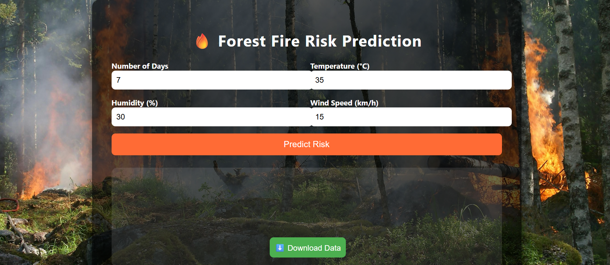
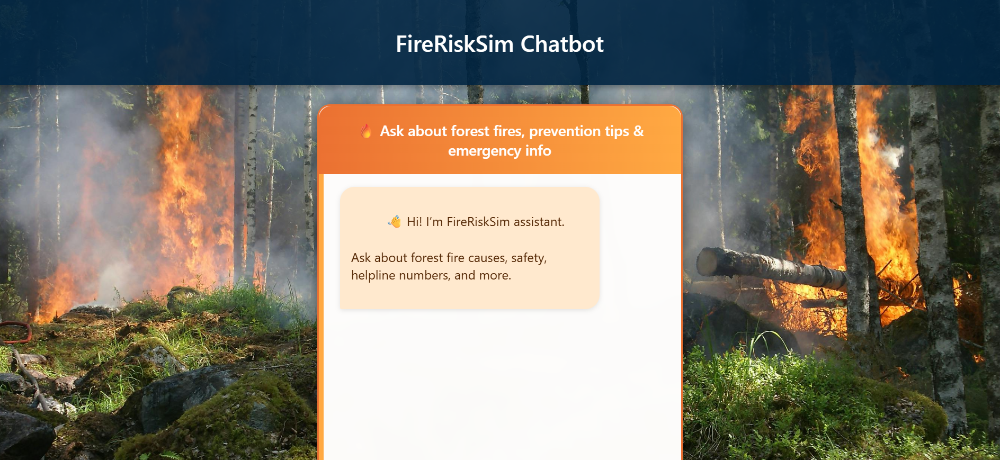
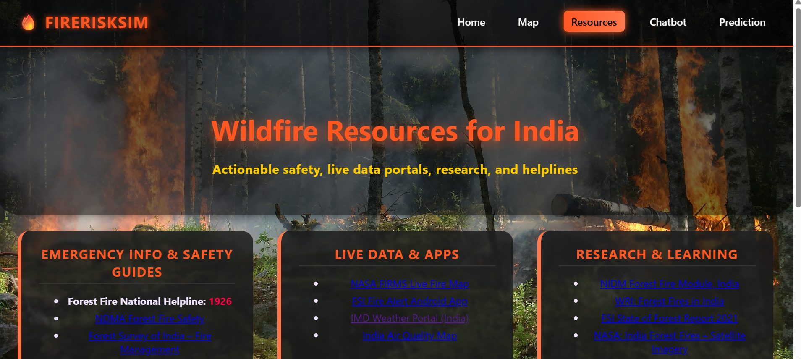

# PREDICTIOn


Here’s a **detailed `README.md`** you can use for your repo:

---

# 🌲 FireRiskSim – Forest Fire Prediction & Simulation

FireRiskSim is an **AI/ML-powered web application** that predicts and simulates **forest fire risks**. It integrates geospatial data, weather parameters, and ML models into a user-friendly interface that helps researchers, students, and policymakers understand and visualize forest fire behavior.

---

## 📖 Table of Contents

* [✨ Features](#-features)
* [📂 Project Structure](#-project-structure)
* [⚙️ Installation & Setup](#️-installation--setup)
* [🖥️ Pages Overview](#️-pages-overview)
* [🛠️ Tech Stack](#️-tech-stack)
* [📸 Screenshots](#-screenshots)
* [🌟 Future Enhancements](#-future-enhancements)
* [📜 License](#-license)

---

## ✨ Features

* 🔥 **Forest Fire Risk Prediction** powered by ML.
* 🗺️ **Interactive Fire Spread Map** (Leaflet.js).
* 📊 **Visualizations** using Plotly.js for risk factors & predictions.
* 🤖 **Chatbot Assistance** for fire safety, FAQs, and project help.
* 📚 **Resource Hub** with fire prevention measures & awareness content.
* 🎛️ **User Controls** to set parameters like humidity, wind, ignition points, NDVI thresholds.
* 📂 **Data Export** (CSV/GeoJSON).
* ⚡ **Backend with Flask** to process ML predictions.

---

## 📂 Project Structure

```
PREDICTION/
│── backend/              
│   ├── app.py            # Flask backend for predictions
│   ├── requirements.txt  # Python dependencies
│── src/                  
│   ├── index.html        # Homepage
│   ├── prediction.html   # Prediction dashboard
│   ├── map.html          # Fire spread visualization
│   ├── chatbot.html      # Chatbot interface
│   ├── resources.html    # Safety & learning resources
│   ├── style.css         # Stylesheet
│   ├── script.js         # JS logic
│── assets/               # Images, icons, and backgrounds
│── README.md             # Documentation
│── venv/                 # Virtual environment (ignored in .gitignore)
```

---

## ⚙️ Installation & Setup

### 1. Clone the repository

```bash
git clone https://github.com/vidhiwhere/PREDICTION.git
cd PREDICTION
```

### 2. Backend Setup (Flask)

```bash
cd backend
pip install -r requirements.txt
python app.py   # or flask run
```

### 3. Frontend Setup

```bash
cd src
# Open index.html in your browser 
# OR run using VS Code Live Server
```

---

## 🖥️ Pages Overview

* **🏠 index.html** – Project landing page with navigation.
* **📊 prediction.html** – Fire risk prediction dashboard.
* **🗺️ map.html** – Interactive visualization of fire spread.
* **🤖 chatbot.html** – Chatbot to answer queries.
* **📚 resources.html** – Awareness, guides, and learning content.

---

## 🛠️ Tech Stack

### **Frontend**

* **HTML5, CSS3, JavaScript** – Core UI
* **Leaflet.js** – Map rendering & fire visualization
* **Plotly.js** – Interactive graphs & charts
* **Bootstrap/Tailwind CSS** (if applied) – Styling

### **Backend**

* **Flask (Python)** – Web framework for predictions
* **Rasterio** – Geospatial data processing
* **Pandas & NumPy** – Data handling
* **scikit-learn / TensorFlow / PyTorch** – ML model training (whichever you used)

### **Other Tools**

* **Git & GitHub** – Version control
* **VS Code** – Development environment

---

## 📸 Screenshots

### 🔹 Homepage (index.html)


### 🔹 Prediction Dashboard (prediction.html)



### 🔹 Fire Spread Map (map.html)


### 🔹 Chatbot (chatbot.html)



### 🔹 Resources Page (resources.html)



---

## 🌟 Future Enhancements

* 🔄 Real-time weather API integration
* 🎥 Animated fire spread simulation
* 📡 Cloud-hosted deployment (Heroku/AWS)
* 📱 Mobile-friendly PWA version
* 🧠 More advanced ML/DL fire models

---

## 📜 License

This project is open-source under the **MIT License**.

---

⚡ Maintained by **[Vidhi](https://github.com/vidhiwhere)**

---

👉 You’ll need to take **screenshots of each page** (index, prediction, map, chatbot, resources), save them in your repo under `assets/`, and then update the README image paths accordingly.

Would you like me to also **write sample alt-text captions** for screenshots (so GitHub README looks polished and is accessible)?
